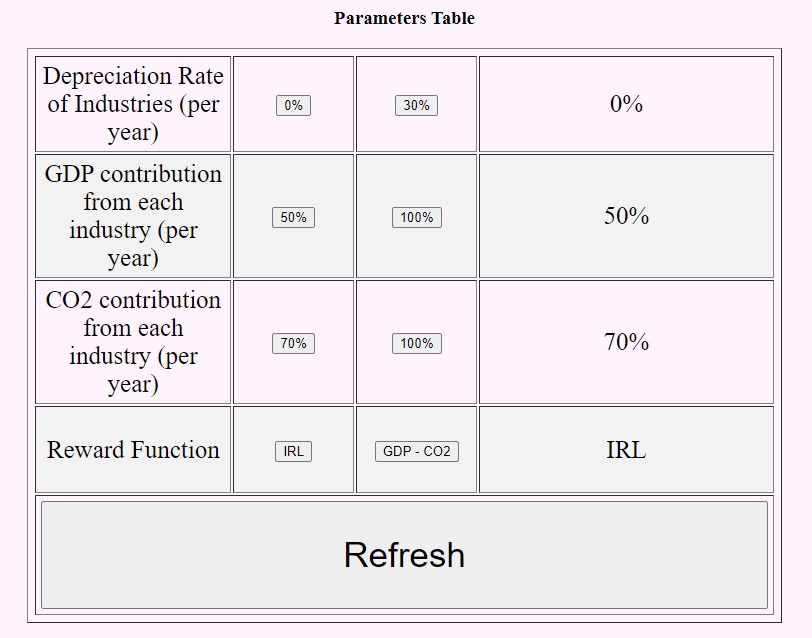

# China-Econ-Simulation
<h1> Introduction </h1>

 This contains an simulation package of China eocnomy. 

 This model forecasts change in GDP and carbon emission given GDP, pollutants, givernment finance data in the past 20 years. 

<h1> Project Website </h1>

 Introduction of the project and result of running simulation model can be seen in the follwoing: 

 https://jl2018-cell.github.io/China-Econ-Simulation/ 

 You can click the buttons then press "refresh" to see result of different parameters settings. 

  </img> 

<h1> Setup </h1>

 Required libraries for this model are: 

<ul>
  <li> pickleshare 0.7.5 </li>
  <li> cloudpickle 1.6.0 </li>
  <li> ray 0.8.4 </li>
  <li> numpy 1.22.0 </li>
  <li> pandas 1.1.3 </li>
  <li> tensorflow-gpu 2.9.1 </li>
  <li> GPUtil 1.4.0 </li>
  <li> gym 0.21.0 </li>
  <li> lz4 4.0.0 </li>
  <li> matplotlib 3.2.1 </li>
  <li> sklearn 0.23.2 </li>
</ul>

 In addition, GPUs are required for simulation. 

 Run simulation model whose agents are intelligent. 

<code> python3 econSimul_train.py </code>

 Run simulation model whose agents act randomly. 

<code> python3 econSimul.py </code>
